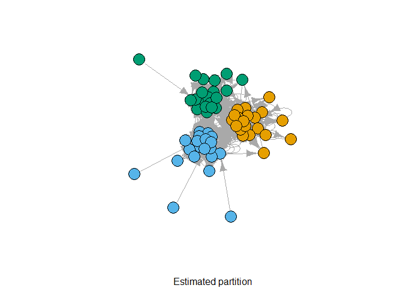

<!-- README.md is generated from README.Rmd. Please edit that file -->

# dcsbm

<!-- badges: start -->

[](https://github.com/mpff/dcsbm/actions)
[](https://app.codecov.io/gh/mpff/dcsbm?branch=main)
[](https://lifecycle.r-lib.org/articles/stages.html#experimental)
<!-- badges: end -->

The goal of dcsbm is to provide methods for estimating a two-way degree
corrected stochastic block model for directed, weighted graphs. Uses the
‘igraph’ library <https://igraph.org> for graph handling. See Peixoto
(2014) \<10.1103/PhysRevE.89.012804\> for details on the inference
algorithm.

## Installation

You can install the development version from
[GitHub](https://github.com/) with:

``` r
# install.packages("devtools")
devtools::install_github("mpff/dcsbm")
```

## Example

This is a basic example which shows you how to solve a common problem:

``` r
library(dcsbm)

# Generate graph by a planted partition model and estimate a degree-corrected SBM.
g <- sample_dcppm(60, c=0.9, k=10, B=3, k_coef=1.5, directed=TRUE, loops=TRUE)
m <- dcsbm(g, degree_correction=TRUE, n.sweeps=5, verbose=FALSE)

# Show model summary.
summary(m)
#> Graph:
#> IGRAPH 12f5793 D--- 60 1200 -- Planted partition model with degree variability
#> + attr: name (g/c), loops (g/l)
#> 
#> Model:
#> SBM with degree correction
#> Optimal number of blocks: 3 
#> 
#> Block transmission probabilities:
#>        [,1]   [,2]   [,3]
#> [1,] 0.9000 0.0350 0.0650
#> [2,] 0.0475 0.9025 0.0500
#> [3,] 0.0600 0.0425 0.8975
#> 
#> Minimum Description Length (MDL) = 0.9688423

# Plot the resulting partition.
plot(g, vertex.color = m$best_partition, vertex.label = NA, sub = "Estimated partition")
```


