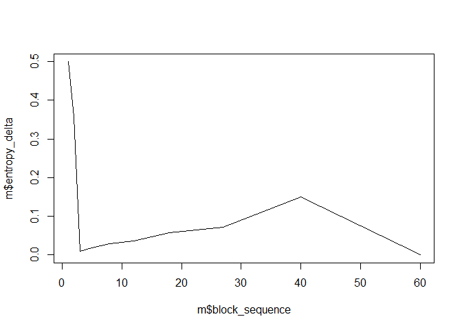

<!-- README.md is generated from README.Rmd. Please edit that file -->

# dcsbm

<!-- badges: start -->

[](https://github.com/mpff/dcsbm/actions)
[](https://lifecycle.r-lib.org/articles/stages.html#experimental)
[](https://app.codecov.io/gh/mpff/dcsbm?branch=main)
<!-- badges: end -->

The goal of dcsbm is to provide methods for estimating a two-way degree
corrected stochastic block model for directed, weighted graphs. Uses the
‘igraph’ library <https://igraph.org> for graph handling. See Peixoto
(2014) \<10.1103/PhysRevE.89.012804\> for details on the inference
algorithm.

## Installation

You can install the development version from
[GitHub](https://github.com/) with:

``` r
# install.packages("devtools")
devtools::install_github("mpff/dcsbm")
```

## Example

This is a basic example which shows you how to solve a common problem:

``` r
library(dcsbm)
#> Loading required package: igraph
#> 
#> Attaching package: 'igraph'
#> The following objects are masked from 'package:stats':
#> 
#>     decompose, spectrum
#> The following object is masked from 'package:base':
#> 
#>     union
#> 
#> Attaching package: 'dcsbm'
#> The following object is masked from 'package:igraph':
#> 
#>     sbm

# Generate graph by a planted partition model and estimate an sbm.
g <- sample_ppm2(30, c=0.9, k=10, B=3)
g <- simplify(g); g <- delete.vertices(g, degree(g) == 0)
m <- sbm(g)
#>   |                                                               |                                                       |   0%  [ 30 -> 20 blocks ]  |                                                               |==                                                     |   3%  |                                                               |====                                                   |   7%  |                                                               |======                                                 |  10%  |                                                               |=======                                                |  13%  |                                                               |=========                                              |  17%  |                                                               |===========                                            |  20%  |                                                               |=============                                          |  23%  |                                                               |===============                                        |  27%  |                                                               |================                                       |  30%  |                                                               |==================                                     |  33%  |                                                               |====================                                   |  37%  |                                                               |======================                                 |  40%  |                                                               |========================                               |  43%  |                                                               |==========================                             |  47%  |                                                               |============================                           |  50%  |                                                               |=============================                          |  53%  |                                                               |===============================                        |  57%  |                                                               |=================================                      |  60%  |                                                               |===================================                    |  63%  |                                                               |=====================================                  |  67%  |                                                               |======================================                 |  70%  |                                                               |========================================               |  73%  |                                                               |==========================================             |  77%  |                                                               |============================================           |  80%  |                                                               |==============================================         |  83%  |                                                               |================================================       |  87%  |                                                               |==================================================     |  90%  |                                                               |===================================================    |  93%  |                                                               |=====================================================  |  97%  |                                                               |=======================================================| 100%
#>   |                                                               |                                                       |   0%  [ 20 -> 13 blocks ]  |                                                               |===                                                    |   5%  |                                                               |======                                                 |  10%  |                                                               |========                                               |  15%  |                                                               |===========                                            |  20%  |                                                               |==============                                         |  25%  |                                                               |================                                       |  30%  |                                                               |===================                                    |  35%  |                                                               |======================                                 |  40%  |                                                               |=========================                              |  45%  |                                                               |============================                           |  50%  |                                                               |==============================                         |  55%  |                                                               |=================================                      |  60%  |                                                               |====================================                   |  65%  |                                                               |======================================                 |  70%  |                                                               |=========================================              |  75%  |                                                               |============================================           |  80%  |                                                               |===============================================        |  85%  |                                                               |==================================================     |  90%  |                                                               |====================================================   |  95%  |                                                               |=======================================================| 100%
#>   |                                                                |                                                        |   0%  [ 13 -> 9 blocks ]  |                                                                |====                                                    |   8%  |                                                                |=========                                               |  15%  |                                                                |=============                                           |  23%  |                                                                |=================                                       |  31%  |                                                                |======================                                  |  38%  |                                                                |==========================                              |  46%  |                                                                |==============================                          |  54%  |                                                                |==================================                      |  62%  |                                                                |=======================================                 |  69%  |                                                                |===========================================             |  77%  |                                                                |===============================================         |  85%  |                                                                |====================================================    |  92%  |                                                                |========================================================| 100%
#>   |                                                                 |                                                         |   0%  [ 9 -> 6 blocks ]  |                                                                 |======                                                   |  11%  |                                                                 |=============                                            |  22%  |                                                                 |===================                                      |  33%  |                                                                 |=========================                                |  44%  |                                                                 |================================                         |  56%  |                                                                 |======================================                   |  67%  |                                                                 |============================================             |  78%  |                                                                 |===================================================      |  89%  |                                                                 |=========================================================| 100%
#>   |                                                                 |                                                         |   0%  [ 6 -> 4 blocks ]  |                                                                 |==========                                               |  17%  |                                                                 |===================                                      |  33%  |                                                                 |============================                             |  50%  |                                                                 |======================================                   |  67%  |                                                                 |================================================         |  83%  |                                                                 |=========================================================| 100%
#>   |                                                                 |                                                         |   0%  [ 4 -> 3 blocks ]  |                                                                 |==============                                           |  25%  |                                                                 |============================                             |  50%  |                                                                 |===========================================              |  75%  |                                                                 |=========================================================| 100%
#>   |                                                                 |                                                         |   0%  [ 3 -> 2 blocks ]  |                                                                 |===================                                      |  33%  |                                                                 |======================================                   |  67%  |                                                                 |=========================================================| 100%
#>   |                                                                 |                                                         |   0%  [ 2 -> 1 blocks ]  |                                                                 |============================                             |  50%  |                                                                 |=========================================================| 100%

# Plot result for 3 blocks.
plot(g, vertex.color = m$partition[[7]], vertex.label = NA)
```


``` r

# Plot entropy delta by number of blocks.
plot(m$block_sequence, m$entropy_delta, type = "line")
#> Warning in plot.xy(xy, type, ...): plot type 'line' will be truncated to first
#> character
```


